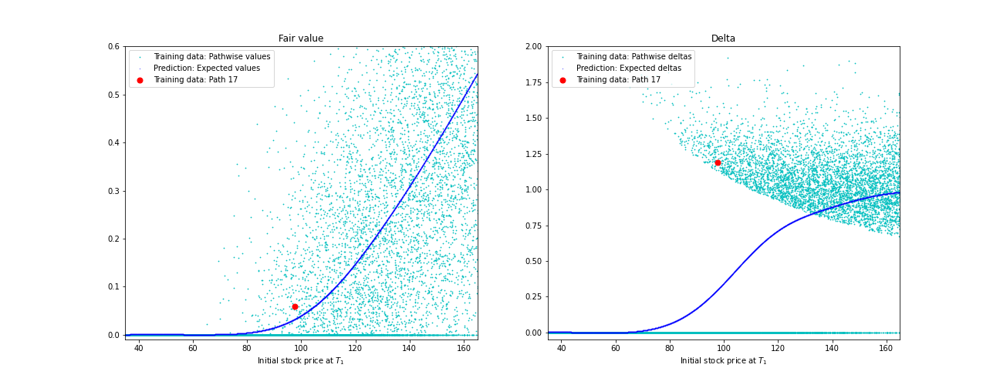

# Differential deep learning with autodiff and autoencoder

[Revisions pending after initial feedback and inputs received from A Savine.]

The notebook [PathwiseDifferentialDeepLearning](https://github.com/jzinnegger/differential-ml/blob/main/PCAandAutoencoder.ipynb) provides an alternative technical implementation of the diffential machine learning approach by Brian Huge and Antoine Savine (see Working paper [[1]](https://arxiv.org/abs/2005.02347) and Risk [[3]](https://www.risk.net/cutting-edge/banking/7688441/differential-machine-learning-the-shape-of-things-to-come)) and builds on examples and implementations provided in the *differential machine learning* GitHub [[2]](https://github.com/differential-machine-learning). The notebook is executable in Colab without additional setup.

Main features of the notebook come with the use of the Keras model framework in Tensorflow 2. The notebook provides two alternative implementations for the backpropagation:
- An __explicit backpropagation__ implemented as additional network on top of the feedforward model (aka the *twin net*). The equation for one step in the backpropagation scheme is encapsulated in a custom layer.
- The utilisation of the __reverse automatic differentation__ that is build-in in tensorflow. The backpropagation is implemented as an *inner (gradient) tape* in a custom Keras layer.

The original implementation in [[2]](https://github.com/differential-machine-learning) includes an example of an equity basket priced with a Bachielier model. The generating model is reused in the notebook. Huge/Savine describe a powerful *differential PCA* as a pre-processing step on values and differentials. This notebook takes an ad-hoc approach and implements an __autoencoder__ as the first layer, specifically to limit the dimensions to the (hopefully) most important latent variables.

The tensorboard logs of the training are available at [tensorboard.dev](https://tensorboard.dev/experiment/u9IjyZK6RgqjvIj16sQdyA/) for interactive analysis.

A write up of the implementation is [here](WorkingPaper.pdf). [revisions required]

An additional notebook [Illustrations](https://github.com/jzinnegger/differential-ml/blob/main/Illustrations.ipynb) provides an illustration of the pathwise regression on the example of an European BS option.

